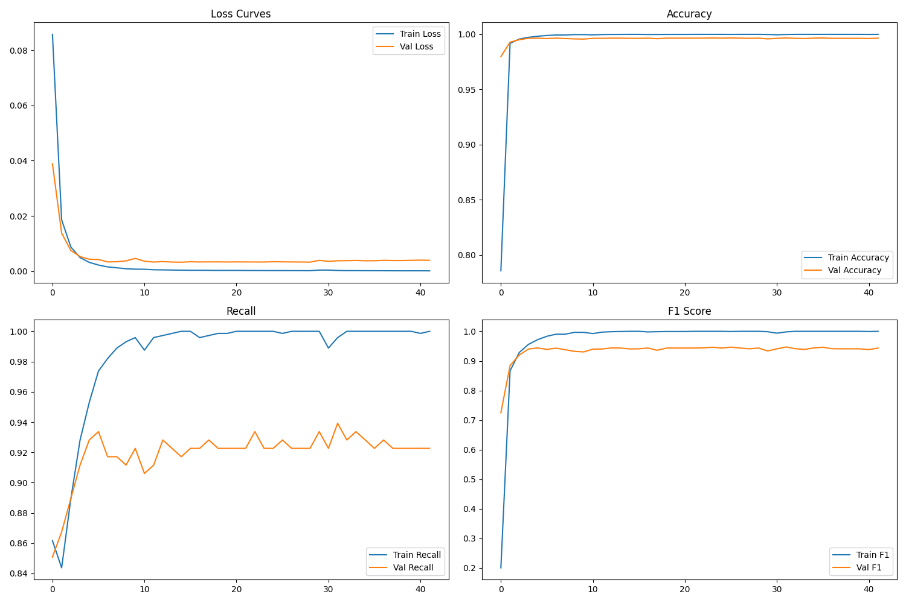
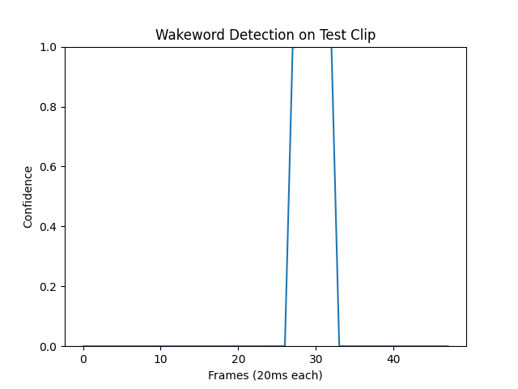

# Модель активации по ключевому слову "Вася"

[](https://opensource.org/licenses/MIT)
[](https://www.python.org/)
[](https://github.com/dscripka/openWakeWord)

Модель для обнаружения ключевых фраз "Вася" и "Эй, Вася" в аудиопотоке. Основана на фреймворке [openWakeWord](https://github.com/dscripka/openWakeWord) под лицензией Apache 2.0.

## 🔍 Фичи
- Высокая точность распознавания (F1-мера > 0.97)
- Генерация синтетических данных с помощью OpenAI TTS

## 📊 Характеристики датасетов

| Тип данных         | Источник                               | Объем     | Длительность |
|--------------------|----------------------------------------|-----------|--------------|
| **Негативные**     | Mozilla Common Voice ru                | 15 000+   | ~15 часов    |
| **Негативные**     | Free Music Archive                     | 8 000+    | ~5 часов     |
| **Негативные**     | Free Sound Dataset                     | 3 000+    | ~3 часа      |
| **Позитивные**     | OpenAI TTS (gpt-4o-mini-tts)          | 2 800     | ~1.5 часа    |

## 🧠 Архитектура модели
```python
class VasyaClassifier(nn.Module):
    def __init__(self, input_dim, hidden_dim=256):
        super().__init__()
        self.flatten = nn.Flatten()
        self.main = nn.Sequential(
            nn.Linear(input_dim, hidden_dim),
            nn.BatchNorm1d(hidden_dim),
            nn.ReLU(),
            nn.Dropout(0.3),
            
            nn.Linear(hidden_dim, hidden_dim//2),
            nn.BatchNorm1d(hidden_dim//2),
            nn.ReLU(),
            nn.Dropout(0.2),
            
            nn.Linear(hidden_dim//2, hidden_dim//4),
            nn.BatchNorm1d(hidden_dim//4),
            nn.ReLU(),
            nn.Dropout(0.1),
            
            nn.Linear(hidden_dim//4, 1),
            nn.Sigmoid()
        )
    
    def forward(self, x):
        x = self.flatten(x)
        return self.main(x)
```

## 📊 Результаты

### Обучение модели
| Метрика       | Значение |
|---------------|----------|
| F1-мера       | 0.9745   |
| Recall        | 0.9556   |
| Точность      | 0.9984   |
| Эпох обучения | 37/100   |

### Тестирование в реальных условиях
| Метрика                     | Значение | Описание                     |
|-----------------------------|----------|------------------------------|
| Ложных срабатываний/час     | 9.0      | Частота ложных активаций     |
| Порог активации             | 0.6      | Уровень уверенности модели   |
| Задержка реакции            | < 300 мс | Время от слова до активации  |

### Визуализация

*Метрики обучения: Loss, Accuracy, Recall, F1-score*


*Пример работы модели на аудиофайле*

## 🚀 Быстрый старт

### Предварительные требования
- Python 3.10+
- NVIDIA GPU (рекомендуется)
- API-ключ OpenAI (для генерации данных)

### Установка
```bash
git clone https://github.com/frum1/vasya_wakeword.git
cd vasya_wakeword
python -m venv .venv
source .venv/bin/activate
pip install -r requirements.txt
```
Скачать [датасет]("drive.google.com")
или
настроить гиперпараметры и сгенерировать свой с помощью `tts_gen.py`
```bash
export OPENAI_API_KEY="ваш api ключ"
python3 tts_gen.py
```


### Использование предобученной модели
```python
import openwakeword

oww_model = openwakeword.Model(
    wakeword_model_paths=["vasya.onnx"],
    enable_speex_noise_suppression=True
)

# Обработка аудиопотока
for frame in audio_stream:
    prediction = oww_model.predict(frame)
    if prediction['vasya'] > 0.6:
        print("Активация обнаружена!")
        # Ваш код реакции на активацию
```
```bash
python3 example.py
```

## 📜 Лицензия
Проект распространяется под лицензией [MIT](LICENSE).

Используемая библиотека для обработки данных [openwakeword](https://github.com/dscripka/openWakeWord) имеет лицензию Apache 2.0.

Используемые датасеты имеют собственные лицензии:
- Common Voice: [CC-0](https://creativecommons.org/publicdomain/zero/1.0/)
- FMA: [CC BY 4.0](https://creativecommons.org/licenses/by/4.0/)
- FSD: [Creative Commons Attribution 4.0 International](https://creativecommons.org/licenses/by/4.0/)

## 👤 Автор
- Telegram: [@p0pug](https://t.me/p0pug)